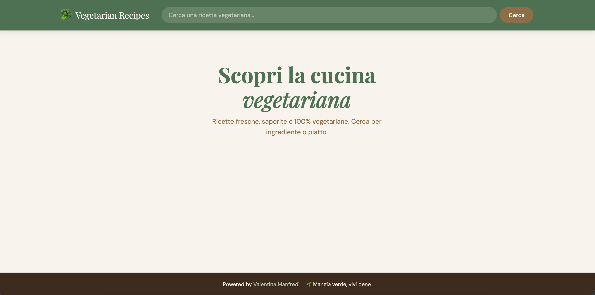
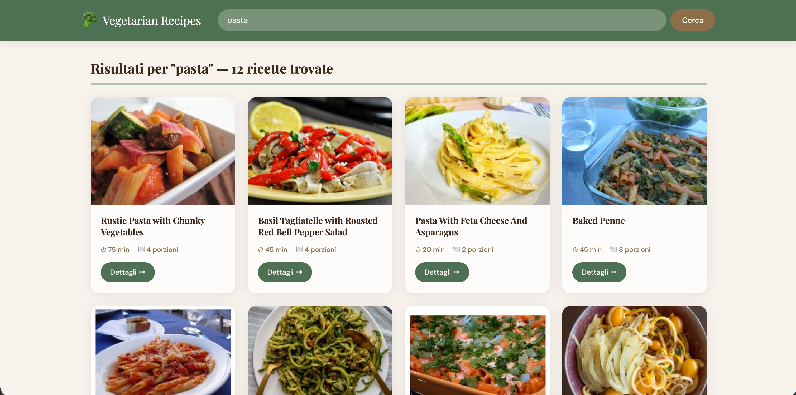

# 🥦 Vegetarian Recipes App

> Un'applicazione web React per scoprire e cucinare ricette vegetariane gustose, powered by Spoonacular API.


---

## 📸 Screenshot




---

## Funzionalità

- **Ricerca ricette** — cerca tra migliaia di ricette vegetariane per ingrediente o nome piatto
- **Griglia risultati** — card con immagine, tempo di preparazione, porzioni e calorie
- **Pagina dettaglio** — ingredienti completi, istruzioni passo-passo e valori nutrizionali
- **Solo vegetariano** — filtraggio automatico tramite `diet=vegetarian`
- **Loading spinner** — feedback visivo durante le chiamate API
- **Gestione errori** — messaggi user-friendly in caso di errore o nessun risultato
- **Responsive** — design mobile-first, funziona su tutti i dispositivi

---

## Stack Tecnologico

| Tecnologia | Versione | Utilizzo |
|---|---|---|
| [React](https://reactjs.org) | 18.2 | Framework UI |
| [React Router DOM](https://reactrouter.com) | 6.22 | Navigazione SPA |
| [Axios](https://axios-http.com) | 1.6 | Chiamate API HTTP |
| [Context API](https://react.dev/reference/react/createContext) | built-in | Stato globale |
| [Spoonacular API](https://spoonacular.com/food-api) | v1 | Dati ricette |
| CSS Vanilla | — | Styling responsive |

---

## Struttura del Progetto

```
vegetarian-recipes/
├── public/
│   └── index.html
├── src/
│   ├── components/
│   │   ├── Header.js        # Header sticky con logo e barra di ricerca
│   │   ├── Footer.js        # Footer con attribuzione Spoonacular
│   │   ├── SearchBar.js     # Form di ricerca con chiamata API
│   │   └── RecipeCard.js    # Card ricetta con info dettagliate
│   ├── contexts/
│   │   └── RecipeContext.js # Context API — stato globale
│   ├── pages/
│   │   ├── Home.js          # Homepage con hero e griglia risultati
│   │   └── RecipeDetail.js  # Pagina dettaglio ricetta
│   ├── services/
│   │   └── api.js           # Funzioni Axios per Spoonacular
│   ├── App.js
│   ├── App.css
│   └── index.js
├── package.json
└── README.md
```

---

## Installazione e Avvio

### Prerequisiti

- Node.js >= 16.x
- npm >= 8.x
- API key Spoonacular gratuita → [Registrati qui](https://spoonacular.com/food-api/console)


## API Endpoints Utilizzati

| Endpoint | Descrizione |
|---|---|
| `GET /recipes/complexSearch` | Ricerca ricette con `diet=vegetarian` |
| `GET /recipes/{id}/information` | Dettaglio ricetta con nutrizione |

---

## Design

- **Palette:** nero `#0d0d0d` + verde brillante `#1db954` + bianco
- **Font:** [Bebas Neue](https://fonts.google.com/specimen/Bebas+Neue) (titoli) + [Nunito](https://fonts.google.com/specimen/Nunito) (corpo)
- **Tema:** dark mode con accenti verde stile Spotify
- **Layout:** CSS Grid + Flexbox, mobile-first

---

## Licenza

Distribuito sotto licenza MIT. Vedi `LICENSE` per maggiori informazioni.

---

## Crediti

- Dati ricette forniti da [Spoonacular](https://spoonacular.com/food-api)

---